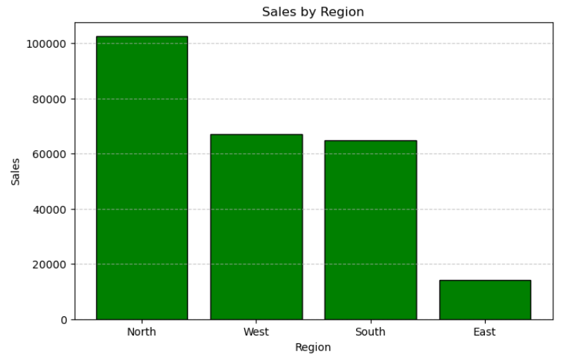

# 📊 Retail Sales Data Analysis using Python

## 📌 Project Overview

This project analyzes retail sales data using Python to identify sales trends, regional performance, product performance, and profitability. The project demonstrates the complete data analysis workflow, including data cleaning, exploratory data analysis (EDA), visualization, and business insights.

---

## 🎯 Objectives

- Clean and preprocess sales data.
- Perform Exploratory Data Analysis (EDA).
- Analyze sales and profit trends.
- Identify top-performing products and regions.
- Generate meaningful business insights using visualizations.

---

## 🛠️ Tools & Libraries

- Python
- Pandas
- NumPy
- Matplotlib
- Jupyter Notebook

---

## 📂 Dataset

The dataset contains retail sales information with fields such as:

- Order Date
- Region
- Product
- Category
- Quantity
- Sales
- Profit

---

## 📊 Analysis Performed

### Data Understanding
- Dataset information
- Data types
- Summary statistics

### Data Cleaning
- Missing value check
- Duplicate check
- Date conversion

### KPI Analysis
- Total Sales
- Total Profit
- Profit Margin

### Exploratory Data Analysis
- Sales by Region
- Profit by Region
- Sales by Product
- Top Performing Products
- Top Performing Regions
- Monthly Sales Trend
- Monthly Profit Trend

### Data Visualization
- Bar Charts
- Horizontal Bar Charts
- Pie Chart
- Line Charts
- Scatter Plot
- Histogram
- Box Plot

---

## 📈 Business Insights

- Identified the best-performing regions based on sales and profit.
- Analyzed top-selling products.
- Observed monthly sales and profit trends.
- Studied the relationship between sales and profit.
- Identified sales distribution using histogram and box plot.

---

## 📁 Project Structure

```
Retail Sales Analytics/
│
├── Sales_Data_Analysis.ipynb
├── sales_data.csv
├── requirements.txt
├── README.md
└── Screenshots/
```

---

## ▶️ How to Run

1. Clone this repository.

```bash
git clone <repository-link>
```

2. Install the required libraries.

```bash
pip install -r requirements.txt
```

3. Open Jupyter Notebook.

4. Run:

```
Sales_Data_Analysis.ipynb
```

---

## 📷 Screenshots

Add screenshots of:

- KPI Analysis
- Sales by Region
- Sales by Product
- Monthly Sales Trend
- Scatter Plot
- Histogram
- Box Plot

inside the **Screenshots** folder.

---

## 📚 Skills Demonstrated

- Data Cleaning
- Data Analysis
- Exploratory Data Analysis (EDA)
- Data Visualization
- Business Insight Generation
- Python Programming
- Pandas
- NumPy
- Matplotlib

---

## 👨‍💻 Author

**Aravind Perala**

Aspiring Data Analyst passionate about transforming raw data into meaningful insights using Python, SQL, Excel, and Power BI.

---

⭐ If you found this project useful, feel free to star the repository.
## Test Image


